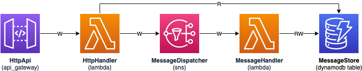

# Meet SAM

A basic demonstration of a Rust project using a SAM template to deploy on AWS. There are many workaround required due to issues in the SAM CLI. DO NOT USE THIS IN A PRODUCTION ENVIRONMENT. THIS IS JUST AN EXAMPLE OF HOW TO USE RUST WITH SAM TEMPLATES AND NOT A SECURE, ROBUST SOLUTION.

## Diagram



## Build

Some workarounds are required to build the project so the SAM CLI can use it correctly. Run the `./build` script to build the project as it is.

## Deploy

Simply run `sam deploy -g` to have a guided deployment, or `sam deploy` if you already have a `samconfig.toml` file created.

## Test

You can call the API it created with the following Postman collection. Make sure to update the variables and to change `message-id` from `Get Message` and `Delete Message` for the actual message ID.

```
{
  "info": {
    "name": "Meet SAM",
    "schema": "https://schema.getpostman.com/json/collection/v2.1.0/collection.json"
  },
  "item": [
    {
      "name": "List Messages",
      "request": {
        "method": "GET",
        "header": [],
        "url": {
          "raw": "{{endpoint}}/",
          "host": [
            "{{endpoint}}"
          ],
          "path": [
            ""
          ]
        }
      }
    },
    {
      "name": "Get Message",
      "request": {
        "method": "GET",
        "header": [],
        "url": {
          "raw": "{{endpoint}}/message-id",
          "host": [
            "{{endpoint}}"
          ],
          "path": [
            "message-id"
          ]
        }
      }
    },
    {
      "name": "Delete Message",
      "request": {
        "method": "DELETE",
        "header": [],
        "url": {
          "raw": "{{endpoint}}/message-id",
          "host": [
            "{{endpoint}}"
          ],
          "path": [
            "message-id"
          ]
        }
      }
    },
    {
      "name": "Send Message",
      "request": {
        "method": "POST",
        "header": [],
        "body": {
          "mode": "raw",
          "raw": "{\n    \"from\": \"me\",\n    \"subject\": \"Hello World\",\n    \"contents\": \"It works!\"\n}",
          "options": {
            "raw": {
              "language": "json"
            }
          }
        },
        "url": {
          "raw": "{{endpoint}}/",
          "host": [
            "{{endpoint}}"
          ],
          "path": [
            ""
          ]
        }
      }
    }
  ],
  "variable": [
    {
      "key": "api-id",
      "value": "",
      "type": "default"
    },
    {
      "key": "region",
      "value": "",
      "type": "default"
    },
    {
      "key": "endpoint",
      "value": "https://{{api-id}}.execute-api.{{region}}.amazonaws.com",
      "type": "default"
    }
  ]
}
```
